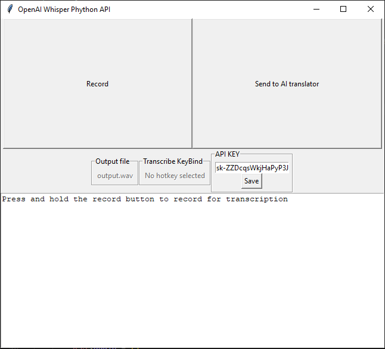

# Whisperpy



## Introduction

Whisperpy is a lightweight and user-friendly application that harnesses the power of OpenAI's Whisper API to transcribe spoken words into text. With just a two-button interface, this program makes voice transcription quick and easy.

## Features

- **Simple Interface**: The program features a straightforward two-button interface, ensuring a hassle-free user experience.
- **AI-Powered Transcription**: Utilizes OpenAI Whisper API to provide accurate and efficient voice-to-text conversion.
- **Effortless Usage**: With minimal setup, users can easily transcribe spoken words with a click of a button.

## Getting Started

1. **Clone the Repository:**
    ```bash
    git clone https://github.com/dopefish0/Whisperpy.git
    ```

2. **Install Dependencies:**
        Minimum Python 3.10.11 https://www.python.org/downloads/

2. **Get OpenAI API key:**
        Register an account with OpenAI: https://platform.openai.com
        Generate your key here: https://platform.openai.com/api-keys

## Known issues
        Hotkey dosent work.
        
## License

This project is licensed under the [MIT License](LICENSE).

---